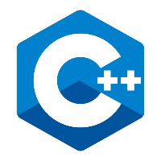

# Jairo Morelli (Generalist Programmer / Android Developer)
<h3> What i'm Interested In :computer: ...</h3> 

Computer hardware, game engine development, how compilers work, 3D 
graphics APIs(OpenGL, Vulkan) and finally phone development.

 

## Currently Learning :memo: ... 
<h3> Currently learning Android phone development, as well as Kotlin.<h3>

## How to reach me :mailbox_with_no_mail: ... 
<h3> Emails: </h3>
<h3>  <a href="mailto:jalbmorelli@hotmail.com"> jalbmorelli@hotmail.com </a> (personal). </h3>
<h3><a href="mailto:jairoalbertomorelli@gmail.com"\>jairoalbertomorelli@gmail.com</a> (work). </h3> 

# Languages I'm currently learning 
  

  

 

# Languages I'm proficient in 

  
 
 

 

# LinkedIn 

