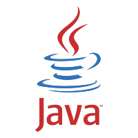

# Jairo Morelli (Game Engine Programmer / General Programmer)
## Im Interested In :computer: ... 
<h3>game development, computer hardware, game engine development, how compilers work. 3D 
graphics API (OpenGL, Vulkan).<h3>

---
## Currently Learning :memo: ... 
<h3> how to build my own GameEngine, while simultaneous improving my knowledge about the C/C++ language. <h3>

---
## How to reach me :mailbox_with_no_mail: ... 
## Emails : (personal) jalbmorelli@hotmail.com 
## (work) jairoAlbertoMorelli@gmail.com 
---
## Languages I'm proficient in ... 

## Links 

